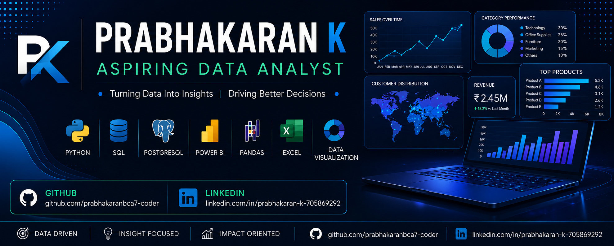

<!-- ===================== BANNER ===================== -->

  

<!-- ================= TYPING ANIMATION ================= -->

 

<!-- ================= PROFILE VIEWS ================= -->

  

<!-- ================= SOCIAL LINKS ================= -->

---

## 👋 About Me

<table>
<tr>

<td width="65%">

### 🚀 Aspiring Data Analyst

I'm **Prabhakaran K**, an aspiring Data Analyst passionate about transforming raw data into meaningful business insights.

I enjoy working with data using:

- 🐍 **Python**
- 🗄️ **SQL & PostgreSQL**
- 📊 **Power BI**
- 📑 **Excel**
- 🔍 **Exploratory Data Analysis**
- 📈 **Data Visualization**

My approach is simple:

> **Understand the data → Find the pattern → Build the insight → Support the decision**

🎯 Currently focused on strengthening my skills in **Advanced SQL, Python Analytics, Power BI, DAX and Business Intelligence**.

</td>

<td width="35%" align="center">

<h3>📊 Data Analytics</h3>

  

  

  

  

</td>

</tr>
</table>

---

# 🛠️ Technical Skills

### 🐍 Python & Data Analysis

### 🗄️ SQL & Databases

### 📊 Business Intelligence

### 📈 Visualization

### 💻 Tools

---

# 📊 My Analytics Workflow

<table>
<tr>

<td align="center">

### 🗃️
### DATA

Raw Data

</td>

<td>→</td>

<td align="center">

### 🧹
### CLEAN

Missing Values 
Duplicates

</td>

<td>→</td>

<td align="center">

### 🔍
### EXPLORE

Patterns 
Trends

</td>

<td>→</td>

<td align="center">

### 🗄️
### ANALYZE

SQL 
Python

</td>

<td>→</td>

<td align="center">

### 📊
### VISUALIZE

Charts 
Dashboards

</td>

<td>→</td>

<td align="center">

### 💡
### INSIGHT

Business 
Impact

</td>

</tr>
</table>

---

# 🚀 Featured Projects

<table>

<tr>

<td width="50%" valign="top">

## 🗄️ SQL Advanced Analysis

Business-focused SQL analysis using PostgreSQL to explore data and answer analytical questions.

**Key Skills**

`SQL` `PostgreSQL` `CTE` `JOIN` `Window Functions`

 

</td>

<td width="50%" valign="top">

## 👥 Customer Behaviour Analysis

Analysis of customer purchasing behavior to identify trends, patterns and useful business insights.

**Key Skills**

`Python` `Pandas` `EDA` `Visualization`

 

</td>

</tr>

<tr>

<td width="50%" valign="top">

## 🐍 Python Data Analysis

Python-based analytics project focused on data cleaning, exploration and visualization.

**Key Skills**

`Python` `Pandas` `NumPy` `Matplotlib`

 

</td>

<td width="50%" valign="top">

## 🧮 SQL Data Loading

Database project focused on loading structured datasets and performing SQL data operations.

**Key Skills**

`SQL` `PostgreSQL` `Database`

 

</td>

</tr>

</table>

---

# 🔎 What I Can Do

| Area | Skills |
|:---|:---|
| 🧹 **Data Cleaning** | Missing values • Duplicates • Validation |
| 🔍 **EDA** | Trends • Patterns • Distributions |
| 🗄️ **SQL** | JOIN • CTE • Subqueries • Window Functions |
| 📊 **Visualization** | Charts • KPIs • Dashboards |
| 👥 **Customer Analytics** | Behavior • Segmentation • RFM |
| 🐍 **Python** | Pandas • NumPy • Matplotlib • Seaborn |
| 📈 **Power BI** | DAX • Dashboards • Data Modeling |
| 💡 **Business Insights** | Analysis • Recommendations • Decision Support |

---

# 📈 GitHub Analytics

 

<!-- ================= ACTIVITY GRAPH ================= -->

---

# 🔥 Contribution Streak

---

# 🐍 Contribution Snake

  <picture>
    <source media="(prefers-color-scheme: dark)" srcset="https://raw.githubusercontent.com/prabhakaranbca7-coder/prabhakaranbca7-coder/gh-pages/github-contribution-grid-snake-dark.svg">
    <source media="(prefers-color-scheme: light)" srcset="https://raw.githubusercontent.com/prabhakaranbca7-coder/prabhakaranbca7-coder/gh-pages/github-contribution-grid-snake.svg">
    
  </picture>

---

# 📚 Currently Learning

---

# 🎯 Career Focus

  

### 🚀 Career Goal

**Transform data → discover insights → create business impact**

---

# 💡 Data Analytics Philosophy

  

### 📊 ANALYZE
### ↓
### 🔍 UNDERSTAND
### ↓
### 💡 DISCOVER
### ↓
### 🚀 IMPACT

---

# 🤝 Let's Connect

  

**📊 Data Analyst | 🐍 Python | 🗄️ SQL | 📈 Power BI**

 

### ⭐ Thanks for visiting my profile!

**Turning Data → Insights → Decisions**

